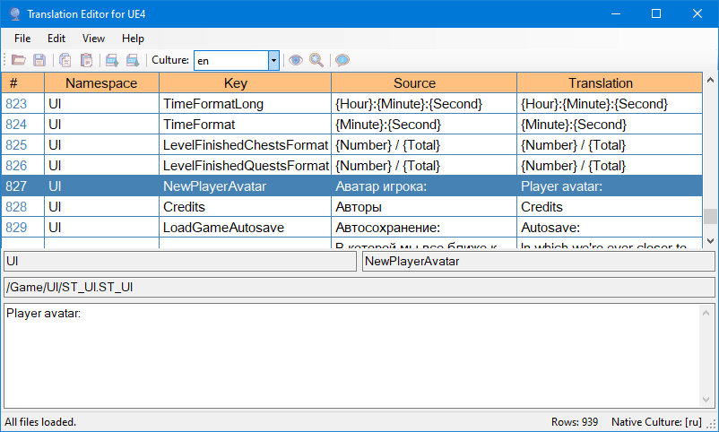
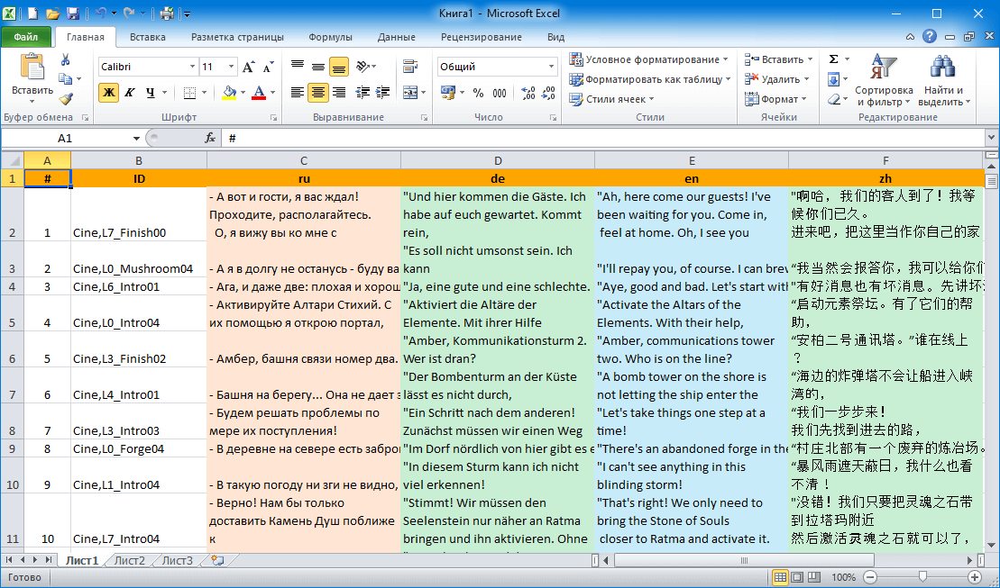

# Translation Editor for UE4

## Compilation and runtime dependencies

- Microsoft Visual Studio 2019
- C# and .Net 4.0 or higher
- Newtonsoft.Json 12.0 *(via NuGet)*
- EPPlus 4.5 *(via NuGet)*

## Features
- Multiline editing *(yes, UE4 still doesn't support it)*
- Export and Import from Excel files
- Sort by any column
- Search text

## Usage

How to edit localizations in the program:

- **Gather** and **Compile** translations in Unreal Engine 4
- Open `*.manifest` file from `[YOUR_PROJECT]\Content\Localization\Game`
- All `*.archive` files will be loaded automaticaly
- Start editing. Press **[Ctrl]+[Enter]** to apply changes.
- Save to `*.manifest` file. All `*.archive` files will be saved automaticaly.
- **Gather** and **Compile** translations in Unreal Engine 4 again.
- Enjoy :)

This program also allows exporting to Microsoft Excel, as well as reimporting back from it. Here's how to do it:

- Open `*.manifest` file.
- Press `File -> Export...` and program will create an Excel file. 
- You will get a single sheet document similar to this one:
    
- Untranslated cells will be highlighted in red. This allows the translator to find them quickly.
- You can edit the document up until the line that says: **--== !!! DO NOT TRANSLATE THE TEXT BELOW !!! == SERVICE DATA ==--**
- You can sort rows any way you like, but before reimporting you need to re-sort them by the first column.
- When you are ready to reimport, start the program and select `File -> Import`.
- Select `File -> Save As...` and save to your `*.manifest` file.
- Don't forget to **Gather** and **Compile** translations in Unreal Engine 4 again.

## Discussion

- [Unreal Engine Forums](https://forums.unrealengine.com/community/community-content-tools-and-tutorials/1497851-opensource-translation-editor-for-ue4)
